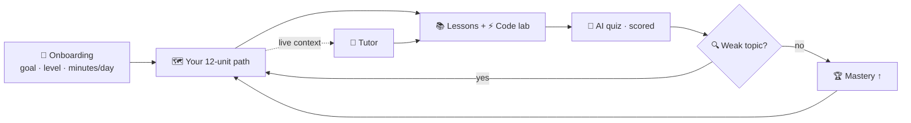
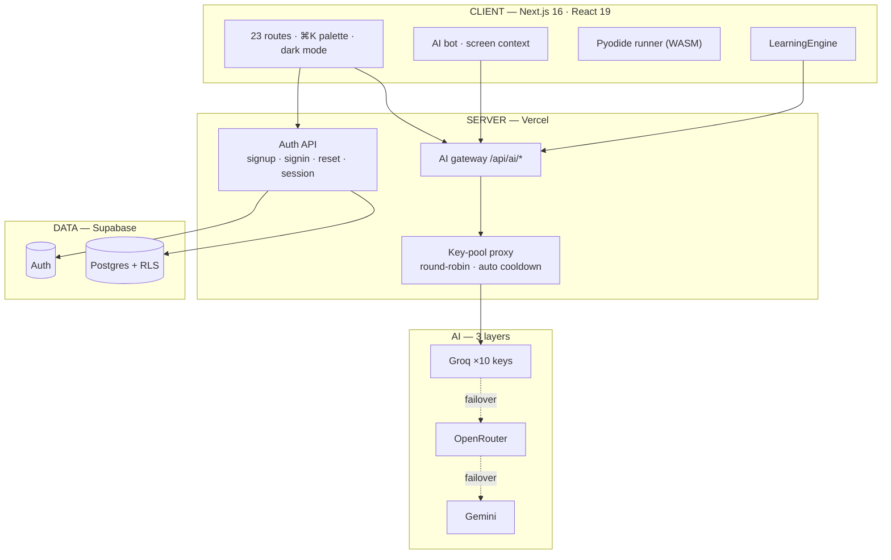

<div align="center">

<br>


# AI-PATH

**The personalised AI tutor that builds your learning path — then reshapes itself around your progress.**

*Build Fast with AI Challenge 2026 · Track PS 03 — Personalised AI Tutor for Learning AI*

[](https://ai-path-tutor.vercel.app)
[](https://nextjs.org)
[](https://react.dev)
[](https://www.typescriptlang.org)
[](https://supabase.com)
[](https://vercel.com)
[](https://playwright.dev)

<br>

[**Launch app →**](https://ai-path-tutor.vercel.app) &nbsp;·&nbsp; [**Pitch deck →**](docs/AI-PATH-Pitch-Deck.pptx) &nbsp;·&nbsp; [**Source →**](https://github.com/MohammedShakib-645/ai-path)

<br>

| &nbsp; | &nbsp; | &nbsp; | &nbsp; |
|---:|---:|---:|---:|
| **23** | **17** | **10** | **0** |
| Pages | Coding languages | Tutor modes | Mock data |

</div>

---

## 🔴 The problem

| Today | What it costs the learner |
|---|---|
| Scattered playlists & blogs | No order, no completion bar |
| Watch-then-forget | Zero proof you understood anything |
| Generic chatbots | No memory of your level or weak spots |

> **AI-PATH answers two questions: _"What do I learn next?"_ and _"Did I really get it?"_**
> Exactly the gap **PS 03** targets.

---

## ✨ Product

| Surface | What it does |
|---|---|
| 🧭 **Adaptive path** | Onboarding (goal · level · daily minutes) → a 12-unit roadmap unique to you; every completed unit updates the whole app live |
| 🤖 **AI Tutor** | 10 teaching modes — each message carries your live profile, so depth and tone adapt to what you've *actually* done |
| 👁️ **Screen-aware bot** | Floating bot reads the page you're on (with an honest eye toggle — off means it truly can't see) and jumps to any section on one command |
| ⚡ **Code lab** | Python + JavaScript run instantly in the browser (Pyodide/WASM) — plus 15 languages on real cloud compilers (C, C++, Java, Go, Rust, C#, TypeScript…) |
| 🧠 **Quizzes that feed back** | Generated from your lessons → scored → weak topics detected → injected into your next explanation |
| 🎤 **Mock interviews** | Webcam room, AI voice questions, dictated answers, graded feedback |
| 📝 **Notes workspace** | Rich notes with sketch pad, AI summarize/flashcards/improve, drag-to-resize cards |
| 📊 **Honest dashboard** | Real streaks, real scores, activity feed — no seeded numbers, ever |

---

## 🧠 Personalisation loop



One deterministic **`LearningEngine`** computes mastery, weak topics and the next best action —
the LLM never invents your progress, it *receives* it. Tutor, dashboard and progress page read the same source, so they never disagree.

---

## 🏗️ Architecture



**Failover:** a key rate-limits → it parks itself (Retry-After honoured) → the next of 10 answers instantly → if all Groq keys park, OpenRouter takes over → then Gemini → if everything fails, an **honest error — never a fabricated answer**. Self-healing, no restarts.

**Boundaries:** secrets live only in Vercel env · every LLM call is proxied server-side · the browser ever sees only the public anon key (safe — RLS enforces access).

---

## 🧰 Tech stack

| Layer | Technologies |
|---|---|
| **Frontend** | Next.js 16 (App Router) · React 19 · TypeScript (strict) · Tailwind CSS · Lucide icons · MDX lessons |
| **In-browser compute** | Pyodide (CPython → WASM) · Web Worker sandbox · Web Speech API (interview voice) |
| **API / edge** | Next.js route handlers on Vercel · server-side key-pool proxy · 40 req/min/IP rate limits |
| **AI providers** | Groq (10-key pool, primary) → OpenRouter → Gemini — automatic 3-layer failover |
| **Code execution** | Local: Python, JavaScript · Cloud: 15 real compilers proxied via `/api/run` (gcc, OpenJDK, mono, Go, Rust…) |
| **Data & auth** | Supabase — email/password auth, HTTP-only cookie sessions, Postgres with row-level security |
| **Quality** | tsc strict · ESLint · Playwright (21 tests, console errors auto-fail) |

---

## 🔌 API surface

| Route | Purpose |
|---|---|
| `POST /api/auth/signup` · `signin` · `signout` · `GET /api/auth/session` | Real auth lifecycle (Supabase-backed) |
| `POST /api/auth/forgot` | Password reset — human messages only |
| `GET/PUT /api/auth/progress` | Progress read/write (RLS-scoped per user) |
| `POST /api/ai/chat` | Tutor / bot gateway — modes, live profile, screen context |
| `POST /api/ai/lesson` | On-demand lesson generation |
| `POST /api/ai/recommend` | Next-unit recommendation from the LearningEngine |
| `POST /api/run` | Real compiler proxy — 15 languages, stdin, honest errors |

---

## 🔐 Security & honesty

| | |
|---|---|
| **Auth** | Real Supabase email/password · HTTP-only cookie sessions · forgot/reset · guest mode |
| **Data** | Row-level security — users read/write **only their own rows** |
| **Secrets** | API keys never ship to the client, never committed |
| **UI truth** | Unconfigured features say so; empty states are real, not seeded |

---

## 🚀 Quick start

```bash
git clone https://github.com/MohammedShakib-645/ai-path.git
cd ai-path && npm install
cp .env.local.example .env.local    # Supabase URL + anon key (optional: AI keys)
npm run dev -- --port 3000          # → http://localhost:3000
```

| Env var | Purpose |
|---|---|
| `NEXT_PUBLIC_SUPABASE_URL` / `_ANON_KEY` | Project identity — public-safe, RLS enforces access |
| `GROQ_KEYS` | Primary AI pool (`gsk_…`, comma-separated) |
| `OPENROUTER_KEYS` / `GEMINI_KEYS` | Fallback pools — automatic failover |
| `NEXT_PUBLIC_OAUTH_PROVIDERS` | Optional `google,github` — OAuth buttons appear when set |

---

## 📁 Project structure

```
src/
├── app/            # 23 routes — dashboard, learn, practice, quizzes, interview, notes…
├── components/     # AI bot, auth screen, editors, toasts, command palette
├── lib/            # LearningEngine, AI gateway + key pool, code runner, store
tests/              # Playwright specs — auth roundtrip, e2e, sidebar, MDX, fit audit
docs/               # Pitch deck
```

---

## ✅ Quality gates

```bash
npx tsc --noEmit          # strict TypeScript → 0 errors
npx eslint src/ tests/    # lint → 0 errors
npx playwright test       # 21 tests — real auth roundtrip, e2e, fit audit
npm run build             # production build
```

Console errors fail the suite automatically — regressions can't slip through.

---

## 🤖 AI disclosure

Development used AI tools — **ChatGPT** and **Google Antigravity** — for drafting, refactoring and testing, alongside standard AI-assisted workflows. Runtime AI: **Groq `openai/gpt-oss-120b`** (×10 key pool) with OpenRouter/Gemini fallback, all server-proxied. Foundation lessons are authored; practice, quizzes and tutor answers are model-generated on demand. Camera/mic stay in the browser.

---

<div align="center">

**[🚀 Launch](https://ai-path-tutor.vercel.app)** · **[📊 Deck](docs/AI-PATH-Pitch-Deck.pptx)** · **[📦 Repo](https://github.com/MohammedShakib-645/ai-path)**

<sub>Real auth · real data · real AI — no mock numbers anywhere.</sub>

</div>
