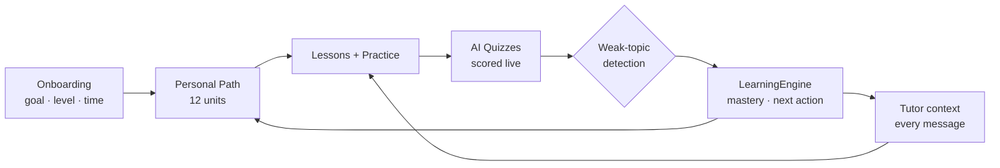

<div align="center">

# 🎓 AI-PATH — Personalised AI Tutor for Learning AI

**Your personal AI tutor that builds a learning path around you — then adapts every lesson,
quiz and explanation to your live progress.**

[](https://ai-path-tutor.vercel.app)
[](https://ai-path-tutor.vercel.app)
[](https://drive.google.com/file/d/1x6GuXbR447IFWwk5L_fjbo_O3yfwUkJDI/view?usp=sharing)
[](https://nextjs.org)
[](https://react.dev)
[](https://supabase.com)
[](https://vercel.com)

**🚀 [Live App](https://ai-path-tutor.vercel.app)** · **[🎬 Demo Video](https://drive.google.com/file/d/1x6GuXbR447IFWwk5L_fjbo_O3yfwUkJDI/view?usp=sharing)** · **📊 [Pitch Deck](docs/AI-Path-Hackathon-Deck.pptx)** · **[🌐 GitHub](https://github.com/MohammedShakib-645/ai-path)**

</div>

---

## 🔴 The problem

Learners who want to get into AI face a messy status quo:

- **Scattered content** — YouTube playlists, blogs, docs… no single path, no order.
- **No feedback loop** — you watch 3 hours of video and still don't know what you *actually* understood.
- **Decision paralysis** — "what do I learn next?" is asked more than any concept.

> **AI-PATH answers exactly two questions: _"What do I learn next?"_ and _"Did I really get it?"_**

That is precisely the gap of **PS 03 — Personalised AI Tutor for Learning AI**.

---

## ✨ What makes it personal (not just another chatbot)

| | Feature | How it personalises |
|---|---|---|
| 🧭 | **Adaptive learning path** | Onboarding (goal · level · daily minutes) → a personal 12-unit roadmap; ticking a unit updates the whole app live |
| 🤖 | **AI Tutor, 10 modes** | Every message carries your live profile (level, units done, avg score, current unit) → the model adapts depth, tone and practice |
| 👁️ | **Screen-aware bot** | The floating bot reads the page you're actually on and answers in context (with an honest eye-toggle: off = it truly can't see) |
| ⚡ | **In-browser code lab** | Real Python execution via Pyodide sandbox — instant, offline-capable, zero server cost |
| 🧠 | **AI quizzes that feed back** | Generated live from your lessons → scored → weak-topic detection → injected into the tutor's next explanation (**closed personalisation loop**) |
| 🎤 | **Mock interviews** | Webcam room, AI voice questions, dictated answers, graded feedback |
| 📊 | **Honest dashboard** | Real streaks (calendar days), real scores, activity feed — **no mock numbers anywhere** |



**One brain (`LearningEngine`)** computes mastery, weak topics and the next best action —
so the tutor, dashboard and progress page never disagree.

---

## 🏗️ Architecture

```
Next.js 16 (App Router)  ──►  Vercel edge/lambda
 ├─ Real auth            ──►  Supabase (email/password, cookie sessions, RLS)
 ├─ Progress sync        ──►  Postgres user_progress (per-user, row-level security)
 ├─ AI chat/tutor/quiz   ──►  /api/ai/*  ─►  Key-pool proxy
 │                                            ├─ Layer 1: Groq ×10 keys (round-robin)
 │                                            ├─ Layer 2: OpenRouter (fast fallback)
 │                                            └─ Layer 3: Gemini (backup)
 ├─ Code runner          ──►  Pyodide (WASM, in-browser)
 └─ Lessons              ──►  authored MDX + model-generated practice
```

**Why a key-pool?** One provider rate-limiting or going down can never take the tutor offline —
a key hitting 429 parks itself and the next key answers instantly (self-healing, no restart).
Keys live **server-side only** (Vercel env) — never in the browser bundle, never in git.

---

## 🗺️ Page map

`/` landing · `/start` onboarding · `/dashboard` · `/learn` roadmap+catalog · `/learn/[id]` AI lesson ·
`/lesson/[id]` MDX lessons · `/ai-tutor` (10 modes, history, pin/rename) · `/quizzes` ·
`/interview` webcam interview room · `/practice` code lab · `/progress` · `/activity` · `/notes` ·
`/saved` · `/planner` · `/projects` · `/doubt` · `/code-explainer` · `/search` · `/settings` ·
`/signup` `/signin` `/reset-password` auth flows · ⌘K command palette everywhere

---

## ⚡ Quick start

```bash
git clone https://github.com/MohammedShakib-645/ai-path.git
cd ai-path
npm install
cp .env.local.example .env.local   # fill NEXT_PUBLIC_SUPABASE_URL / _ANON_KEY (+ optional keys)
npm run dev -- --port 3000
# open http://localhost:3000
```

### Environment (Vercel → Settings → Environment Variables — never committed)

| Var | Purpose |
|---|---|
| `NEXT_PUBLIC_SUPABASE_URL` / `NEXT_PUBLIC_SUPABASE_ANON_KEY` | Project URL + anon key (safe to be public — RLS enforces access) |
| `GROQ_KEYS` | comma-separated Groq keys (`gsk_...`, free at console.groq.com) — primary pool |
| `GEMINI_KEYS` / `OPENROUTER_KEYS` | backup pools — automatic failover |
| `NEXT_PUBLIC_OAUTH_PROVIDERS` | optional `google,github` — shows OAuth buttons once configured |

---

## ✅ Testing & quality gates

```bash
npx tsc --noEmit                    # 0 errors — strict TypeScript
npx eslint src/ tests/              # 0 errors
npx playwright test                 # 22 tests, 7 suites — e2e, sidebar, lessons,
                                    #   cmd-K, path actions, AUTH roundtrip
node scripts/auth-fit.mjs           # viewport fit audit (1920→1280, zero scroll)
npm run build                       # production build
```

The suite fails on **any browser console error**, so rendering regressions are caught automatically.
Auth tests run a real signup → session → sign-out → sign-in roundtrip against the live backend.

---

## 🔐 Security & honesty

- **Auth is real** — Supabase email/password, HTTP-only cookie sessions, forgot/reset flow, guest mode.
- **Row-level security** — users can only ever read/write their own progress rows.
- **API keys never ship to the browser** — all LLM calls go through server routes; secrets live in Vercel env only.
- **No fake UI** — unconfigured features say so honestly; empty states are real, never seeded.

---

## 🤖 AI tools disclosure (per challenge rules)

- Built pair-programming with **OpenCode** as the coding agent.
- Runtime LLMs: **Groq `openai/gpt-oss-120b`** (primary pool) · OpenRouter fallback · Gemini backup.
- MDX foundation lessons are editorial; practice questions, quizzes, plans and tutor answers are model-generated on demand.
- Camera/mic (interview room) stay in the browser — nothing is uploaded.

---

<div align="center">

**Built for the Build Fast with AI Challenge 2026 — track: PS 03, Personalised AI Tutor for Learning AI**

[Live App](https://ai-path-tutor.vercel.app) · [Demo Video](https://drive.google.com/file/d/1x6GuXbR447IFWwk5L_fjbo_O3yfwUkJDI/view?usp=sharing) · [Deck](docs/AI-Path-Hackathon-Deck.pptx)

</div>
