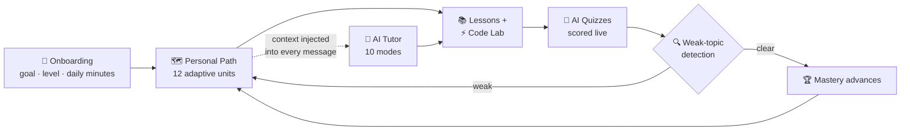
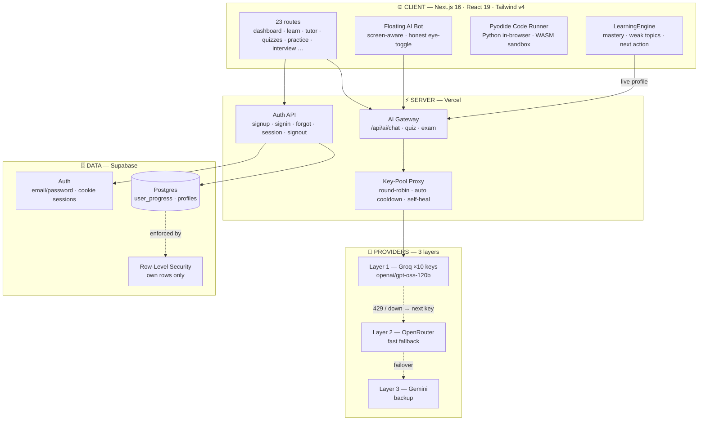

<div align="center">

# AI-PATH

### Personalised AI Tutor for Learning AI

**A full-stack, adaptive learning platform that builds your personal path from beginner to building real AI — and reshapes itself around your live progress.**

[](https://ai-path-tutor.vercel.app)
[](https://ai-path-tutor.vercel.app)
[](https://nextjs.org)
[](https://react.dev)
[](https://supabase.com)
[](https://www.typescriptlang.org)
[](https://vercel.com)

**[🚀 Live App](https://ai-path-tutor.vercel.app)** · **[📊 Pitch Deck](docs/AI-PATH-Pitch-Deck.pptx)** · **[📦 Repository](https://github.com/MohammedShakib-645/ai-path)**

<br>

<sub><b>23 pages</b> · <b>10 tutor modes</b> · <b>3-layer AI failover</b> · <b>real auth + RLS</b> · <b>zero mock data</b></sub>

</div>

---

## 📚 Table of Contents

1. [The Problem](#-1-the-problem)
2. [The Solution](#-2-the-solution)
3. [Personalisation Engine](#-3-personalisation-engine)
4. [System Architecture](#-4-system-architecture)
5. [Feature Matrix](#-5-feature-matrix)
6. [Reliability — AI Key-Pool](#-6-reliability--ai-key-pool)
7. [Security Model](#-7-security-model)
8. [Tech Stack](#-8-tech-stack)
9. [Page Map](#-9-page-map)
10. [Getting Started](#-10-getting-started)
11. [Quality Gates](#-11-quality-gates)
12. [Roadmap](#-12-roadmap)
13. [AI Disclosure](#-13-ai-disclosure)

---

## 🔴 1 · The Problem

| Status quo | Consequence |
|---|---|
| Scattered YouTube playlists, blogs, docs | No order, no completion criteria |
| Watch-then-forget content | Zero feedback on what you *actually* understood |
| "What do I learn next?" | Asked more often than any real concept |
| Generic chatbots | No memory of your level, progress or weak topics |

> **AI-PATH answers exactly two questions — _"What do I learn next?"_ and _"Did I really get it?"_**
> That is precisely the gap of **PS 03 — Personalised AI Tutor for Learning AI**.

---

## ✅ 2 · The Solution

An end-to-end learning product — not a prompt wrapper:

- **Onboarding → personal path** — goal, level and daily minutes compile into a 12-unit roadmap unique to the learner.
- **Every surface shares one brain** — the tutor, dashboard and progress page read the same `LearningEngine`, so they never disagree.
- **AI that sees your context** — each tutor message carries your live profile *and* (optionally) the exact page you're reading.
- **Practice → assessment → adaptation** — code lab and quizzes produce real signal that changes the next lesson.
- **Real accounts, real data** — Supabase auth with cookie sessions; progress syncs per-user behind row-level security.

---

## 🧠 3 · Personalisation Engine



**`LearningEngine`** — a single deterministic module — computes mastery, weak topics and the
next best action from your real records. The LLM never invents your progress; it *receives* it.

---

## 🏗️ 4 · System Architecture



| Boundary | Responsibility | Guarantee |
|---|---|---|
| **Client** | Rendering, Pyodide execution, local intent routing (`open X`) | Secrets never enter the bundle |
| **Server** | Session cookies, LLM calls, key rotation | All provider keys stay server-side |
| **Data** | Durable per-user progress | RLS: users touch only their own rows |
| **Providers** | Answer generation | 3 layers — no single point of failure |

---

## 🧩 5 · Feature Matrix

| Domain | Capabilities |
|---|---|
| **Learn** | Adaptive roadmap · 12 units · authored MDX lessons · AI lesson explanations · completion tracking |
| **AI Tutor** | 10 modes (Explain, Teach, Debug, Review, Generate, Practice, Interview, Exam, Mentor, Planner) · chat history · pin/rename · follow-up chips |
| **Floating Bot** | Screen-aware answers · one-tap navigation (`"open quizzes"`) · task shortcuts · attachment paste (images/PDF) |
| **Practice** | Real Python execution in-browser · AI hints · code analysis |
| **Assessment** | Easy/Medium/AI-generated quizzes · grading · weak-topic feedback into the tutor |
| **Career** | AI mock interviews — webcam room · voice questions · dictated answers · feedback |
| **Tools** | Doubt solver · Code explainer · Smart notes · Saved bookmarks · Study planner · Projects |
| **Platform** | Email/password auth · forgot/reset · guest mode · ⌘K palette · dark mode · mobile-first · PWA |

---

## ⚙️ 6 · Reliability — AI Key-Pool

```
request ──► round-robin cursor ──► Groq key #n
                 │                       │
                 │              429 / 5xx / timeout
                 │                       ▼
                 │              key parks itself (Retry-After honoured)
                 ▼                       │
         next healthy key ◄──────────────┘
                 │
        all Groq parked? ──► OpenRouter ──► Gemini ──► honest error (never fake)
```

- **10 Groq keys** rotate round-robin — one key's rate limit becomes a non-event.
- **Self-healing** — parked keys re-enter rotation automatically; no restarts, no dashboards.
- **Honest degradation** — if every layer fails, the user gets a truthful message, never a fabricated answer.

---

## 🔐 7 · Security Model

| Layer | Mechanism |
|---|---|
| **Authentication** | Supabase email/password · HTTP-only session cookies · auto-refresh · forgot/reset flow · explicit guest mode |
| **Authorization** | Postgres Row-Level Security — `user_progress` and `profiles` policies bind rows to `auth.uid()` |
| **Secrets** | LLM keys exist only in Vercel environment variables; server routes proxy every call |
| **Client exposure** | Only the Supabase URL + anon key ship to the browser (safe by design — RLS enforces access) |
| **Honesty** | Unconfigured features say so explicitly; empty states are real, never seeded |

---

## 🛠️ 8 · Tech Stack

| Layer | Choice |
|---|---|
| Framework | **Next.js 16** (App Router, webpack) · **React 19** |
| Language | **TypeScript** — strict, 0-error gates |
| Styling | **Tailwind CSS v4** · dark mode · mobile-first |
| Auth + DB | **Supabase** (GoTrue auth · Postgres · RLS) |
| AI | **Groq** `openai/gpt-oss-120b` (×10 pool) · OpenRouter · Gemini |
| Compute | **Pyodide** — Python compiled to WASM, runs 100% in-browser |
| Deploy | **Vercel** — edge/lambda, free tier |
| Testing | **Playwright** — 7 suites · console-error traps · viewport fit audit |

---

## 🗺️ 9 · Page Map

| Area | Routes |
|---|---|
| Core | `/` landing · `/start` onboarding · `/dashboard` |
| Learn | `/learn` · `/learn/[id]` · `/lesson/[id]` · `/progress` · `/activity` |
| AI | `/ai-tutor` · `/quizzes` · `/practice` · `/doubt` · `/code-explainer` · `/interview` |
| Tools | `/notes` · `/saved` · `/planner` · `/projects` · `/achievements` · `/search` |
| Account | `/signup` · `/signin` · `/reset-password` · `/settings` |

*Old URLs 308-redirect (`/courses`, `/learning-path`, `/roadmap` → `/learn`). ⌘K works everywhere.*

---

## 🚀 10 · Getting Started

```bash
git clone https://github.com/MohammedShakib-645/ai-path.git
cd ai-path
npm install
cp .env.local.example .env.local   # fill Supabase URL + anon key (optional: AI keys)
npm run dev -- --port 3000
# → http://localhost:3000
```

### Environment variables (Vercel → Settings — never committed)

| Variable | Purpose |
|---|---|
| `NEXT_PUBLIC_SUPABASE_URL` / `NEXT_PUBLIC_SUPABASE_ANON_KEY` | Project identity (public-safe, RLS enforces access) |
| `GROQ_KEYS` | Comma-separated Groq keys — primary pool |
| `OPENROUTER_KEYS` / `GEMINI_KEYS` | Fallback pools — automatic failover |
| `NEXT_PUBLIC_OAUTH_PROVIDERS` | Optional `google,github` — enables OAuth buttons |

---

## ✅ 11 · Quality Gates

```bash
npx tsc --noEmit                 # strict types — 0 errors
npx eslint src/ tests/           # lint — 0 errors
npx playwright test              # 7 suites — auth roundtrip, e2e, sidebar,
                                 #   lessons, ⌘K, path actions
node scripts/auth-fit.mjs        # viewport fit audit — 1920→1280, zero scroll
npm run build                    # production build
```

- The e2e suite **fails on any browser console error** — rendering regressions can't slip through.
- Auth tests perform a **real signup → session → sign-out → sign-in roundtrip** against the live backend.

---

## 📍 12 · Roadmap

- [ ] Google / GitHub OAuth (env-gated — buttons appear the moment credentials exist)
- [ ] Streaming replies (token-by-token rendering)
- [ ] Team/classrooms with shared progress
- [ ] Spaced-repetition review queue

---

## 🤖 13 · AI Disclosure

Per challenge rules — full transparency:

- **Pair-programming:** built with **OpenCode** as the coding agent.
- **Runtime models:** Groq `openai/gpt-oss-120b` (primary) · OpenRouter (fallback) · Gemini (backup).
- **Content:** MDX foundation lessons are editorial; practice questions, quizzes, plans and tutor answers are model-generated on demand.
- **Privacy:** camera/mic (interview room) stay in the browser; no uploads.

---

<div align="center">

### Built for the Build Fast with AI Challenge 2026 · Track PS 03 — Personalised AI Tutor for Learning AI

**[🚀 Live App](https://ai-path-tutor.vercel.app)** · **[📊 Deck](docs/AI-PATH-Pitch-Deck.pptx)**

<sub>Real auth · real data · real AI — no mock numbers anywhere.</sub>

</div>
